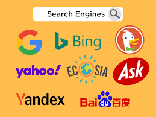

# Build Your Own Search Engine



Code for the "Build Your Own Search Engine" workshop

Video: https://www.youtube.com/watch?v=nMrGK5QgPVE


What we will do: 

* Use Zoomcamp FAQ documents
    * [DE Zoomcamp](https://docs.google.com/document/d/19bnYs80DwuUimHM65UV3sylsCn2j1vziPOwzBwQrebw/edit)
    * [ML Zoomcamp](https://docs.google.com/document/d/1LpPanc33QJJ6BSsyxVg-pWNMplal84TdZtq10naIhD8/edit)
    * [MLOps Zoomcamp](https://docs.google.com/document/d/12TlBfhIiKtyBv8RnsoJR6F72bkPDGEvPOItJIxaEzE0/edit)
* Create a search engine for retreiving these documents 
* Later the results can be used for a [Q&A RAG system](https://github.com/alexeygrigorev/llm-rag-workshop) 
* [Reference implementation for text search](https://github.com/alexeygrigorev/minsearch)


## Workshop Outline

1. **Preparing the Environment**
2. **Basics of Text Search**
    - Basics of Information Retrieval
    - Introduction to vector spaces, bag of words, and TF-IDF
3. **Implementing Basic Text Search**
    - TF-IDF scoring with sklearn
    - Keyword filtering using pandas
    - Creating a class for relevance search
4. **Embeddings and Vector Search**
    - Vector embeddings
    - Word2Vec and other approaches for word embeddings
    - LSA (Latent Semantic Analysis) for document embeddings
    - Implementing vector search with LSA
    - BERT embeddings 
5. **Combining Text and Vector Search**
6. **Practical Implementation Aspects and Tools**
    - Real-world implementation tools:
        * inverted indexes for text search
        * LSH for vector search (using random projections)
    - Technologies:
        * Lucene/Elasticsearch for text search
        * FAISS and other vector databases


## 1. Preparing the environment

In the workshop, we'll use Github Codespaces, but you can use any environment

We need to install the following libraries:

```bash
pip install requests pandas scikit-learn jupyter
```